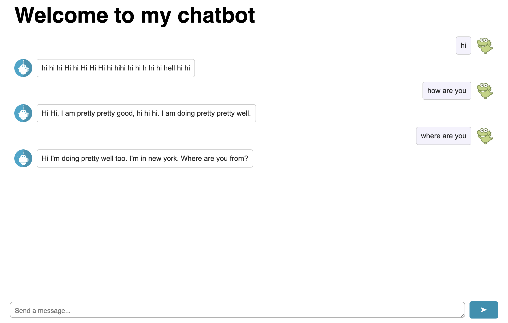

# Building chatbot

## Pre-requisite
1. install Flask
```
pip install flask
```

2. install python libraries

```
pip install transformers torch
```

## Step 1: Build a simple chatbot with fixed input

Build a simple terminal-based chatbot using [Facebook's blenderbot model](https://huggingface.co/facebook/blenderbot-400M-distill) and `transformers` python library from Hugging Face.

To run: 
```
python3 1-chatbot.py
```

Since the input is already specified, you'll see the output look like below: 
```
Input: {'input_ids': tensor([[1710,   86,   19,  544,  366,  304,  929,   38]]), 'attention_mask': tensor([[1, 1, 1, 1, 1, 1, 1, 1]])}
Output: tensor([[   1,  281,  476,  929,  731,   21,  281,  632,  929,  712,  731,   21,
          855,  366,  304,   38,  946,  304,  360,  463, 5459, 7930,   38,    2,
            2]])
Decoded output: I'm doing well. I am doing very well. How are you? Do you have any hobbies?
Conversation history: ['hello, how are you doing?', "I'm doing well. I am doing very well. How are you? Do you have any hobbies?"]
```

_Note: You can move to the next step directly if you're familiar with the code. I just created this extra step to make sure everything is running without any inputs first._

## Step 2: Build a simple chatbot that receives inputs from terminal
Similar to [previous app](./1-chatbot.py), except this one accepts inputs.


## Step 3: Create a simple web app using Flask

_Optional: If you're familiar with Flask, you can skip this step._

**Pre-requisite**

Install the following python packages:
```
pip install flask
pip install flask_cors
```

By default, if the Flask app file name is `app.py`, then you can simply run `flask run` to start the server. In this repo, the file name `3-app.py` is used, therefore, we need to set the `FLASK_APP` variable first, i.e. 


```sh 
$ export FLASK_APP=3-app.py
$ flask run
```

From a browser, go to http://127.0.0.1:5000.

# Step 4: Integrate chatbot in the Flask server

Add the route `/chatbot` to include the code we have in [Step 2](#step-2-build-a-simple-chatbot-that-receives-inputs-from-terminal). 


To run:
```sh 
$ export FLASK_APP=4-app.py
$ flask run
```

From another terminal, type the following curl command with the prompt:
```
curl -X POST -H "Content-Type: application/json" -d '{"prompt": "Hello, how are you today?"}' 127.0.0.1:5000/chatbot
```

The output would look like below:
```
I am doing well today today. I am very very very happy today. How are you?
```

# Step 5: Add a web page to take inputs

The scripts and images are originated from [this repo](https://github.com/ibm-developer-skills-network/LLM_application_chatbot) as part of the exercises from the course. 

Files added in this step:
- [5-app.py](./5-app.py): the Flask app
- [templates/index.html](./templates/index.html): the web page for this chatbot. 
- [static folder](./static/): contains the images and css files used in this chatbot. More importantly, it contains the [script.js](./static/script.js) where the chatbot backend is called. 

_Note: By default, `render_template` function in Flask will look for the file under the `templates` folder. If you want to put it somewhere else, you'd need to specify it:_ 

```
app = Flask(__name__, template_folder='your_folder_name')
```

As usual, to run:
```sh
$ export FLASK_APP=5-app.py
$ flask run
```

