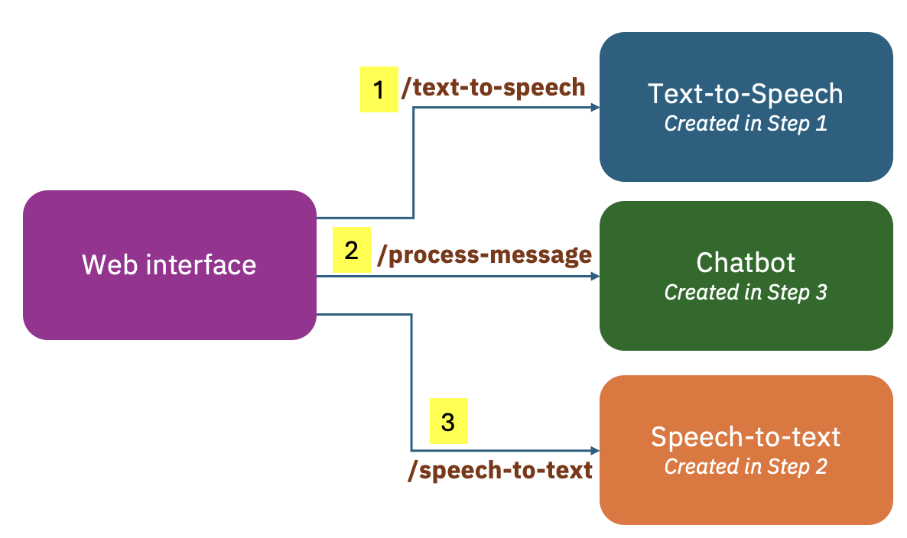

# Voice assistant

This repo is originated from https://github.com/arora-r/chatapp-with-voice-and-openai-outline.git, mostly for the UI portion. I've deviated a bit on the backend components. 

Here is the overview we're going to build for the voice assistant.


The application is under [4-voice-agent folder](./4-voice-agent/). To run the application, go to that directory, run:
```
python3 app.py
```

Here is the demo: [demo](./VoiceAssitant-demo.mp4). I've edited the video to remove or speed up the waiting time. 

## Step 1: Text-to-Speech

First, create a [Text to speech service](https://cloud.ibm.com/catalog/services/text-to-speech) on [IBM Cloud](https://cloud.ibm.com/). A free/lite plan should be enough for learning purpose.

After the service is created, you can get the API key and service URL to call the service. 

To test your API key and service URL, you can run the following curl command:
```sh
curl -X POST -u "apikey:{apikey}" --header "Content-Type: application/json" --header "Accept: audio/wav" --data "{\"text\":\"hello world\"}" --output hello_world.wav "{url}/v1/synthesize?voice=en-US_MichaelV3Voice"
```
Replace `{apikey}` and `{url}` with the values you had. 
You can also select a different voice and language. For details, see [the tutorial](https://cloud.ibm.com/docs/text-to-speech?topic=text-to-speech-gettingStarted#getting-started-tutorial).


To run: 

1. Install `ibm-watson` python library
    ```ssh
    pip install ibm-watson
    ```

2. Set the environment variables `TTS_API_KEY` and `TTS_SERVICE_URL`. They are the API key and service URL for the Text-to-Speech service on IBM Cloud that was created previously. 

    ```ssh
    export TTS_API_KEY={your_api_key}
    export TTS_SERVICE_URL={your_service_url}
    ```

To check it's set properly:
    ```ssh
    echo $TTS_API_KEY
    ```

3. Run the Python script using the command below:
    ```ssh
    python3 1.tts.py
    ```

As a result, a file `output.wav` will be created in the same folder as `1-tts.py`. 

### Reference
- API Docs: https://cloud.ibm.com/apidocs/text-to-speech
- Python SDK: https://github.com/watson-developer-cloud/python-sdk


## Step 2: Speech-to-Text
First, create a [Speech-to-Text service](https://cloud.ibm.com/catalog/services/speech-to-text) on [IBM Cloud](https://cloud.ibm.com/).

To run:
1. Set the environment variables `STT_API_KEY` and `STT_SERVICE_URL` 
2. Run the following command:
```
python3 2-stt.py
```

The output looks like: 
```
python3 2-stt.py
{
  "result_index": 0,
  "results": [
    {
      "final": true,
      "alternatives": [
        {
          "transcript": "hello world ",
          "confidence": 0.99
        }
      ],
      "word_alternatives": [
        {
          "start_time": 0.0,
          "end_time": 0.33,
          "alternatives": [
            {
              "word": "hello",
              "confidence": 1.0
            }
          ]
        },
        {
          "start_time": 0.33,
          "end_time": 0.81,
          "alternatives": [
            {
              "word": "world",
              "confidence": 0.96
            }
          ]
        }
      ],
      "keywords_result": {
        "hello": [
          {
            "start_time": 0.0,
            "end_time": 0.33,
            "confidence": 1.0,
            "normalized_text": "hello"
          }
        ]
      }
    }
  ]
}
```

API Docs: https://cloud.ibm.com/apidocs/speech-to-text

## Step 3: OpenChat

As one of the labs in the course [Building Generative AI-Powered Applications with Python](https://www.coursera.org/learn/building-gen-ai-powered-applications/home/welcome), it suggested to use the `gpt-4` model from OpenAI. Unfortunately, I was not able to get it to run without paying extra credits. There are other models that need sign-ups. As a result, I'm switching to use [`openchat/openchat-3.5-1210` model](https://huggingface.co/openchat/openchat_3.5) from HuggingFace. 


1. Install python libraries 
    ```
    pip install transformers accelerate torch
    ```

2. To run:
    ```
    python3 3-chatpot.py
    ```

### Reference
- OpenAI APIs are not being used in my app, but here are some references I've looked up:
    - OpenAI repo: https://github.com/openai/openai-python
    - OpenAI docs: https://platform.openai.com/docs/overview
    - Get API key: https://platform.openai.com/settings/organization/api-keys
- OpenChat: https://huggingface.co/openchat/openchat_3.5


## Step 4 - Putting everything together

Now that we have created:
- text-to-speech component using IBM Cloud's Text-To-Speech service
- speech-to-text component using IBM Cloud's Speech-to-Text service
- chatbat component using the OpenChat model

Let's put everything together and create a voice assistant interface using Flask.

The application is under [4-voice-agent folder](./4-voice-agent/). To run the application, go to that directory, run:
```
python3 app.py
```

Here is the demo: [demo](./VoiceAssitant-demo.mp4). I've edited the video to remove or speed up the waiting time. 

I've made a few changes along the way:

1. Use config file `.env` for API keys and service URLs

In the previous steps, I use environment variables for the API keys and the service URLs. We only have 4 config properties in total, so it's still manageable, but it's better to switch to use `.env`.  In Python, `python-dotenv` provides an easy way to load the `.env` file into variables.

```
pip install flask python-dotenv
```

One thing to note is to make sure the `.env` file didn't get pushed to GitHub. `.gitignore` is updated to include that. 

2. Limit the number of tokens returned
In [processmg.py](./4-voice-agent/processmsg.py), I intentionally limite the number of tokens returned. I reached the threshold of a free plan for the Text-to-Speech service. Since this is an experimental application, it works for me to reduce that number. 

When you hit the usage overlimit issue, you'll likely receive a "Forbidden" error message and can check your usage on IBM Cloud. Simply delete the existing service and create a new one. Make sure you update the API key and URL accordingly. 

3. Future work
- When calling the Text-to-Speech service, the audio is saved into a file. As a next step, it would be good to make it as a audio stream.
- The UI is using JQuery which I'm not very familiar with. I'd like to eventually update it to use React or other more modern UI framework. 
